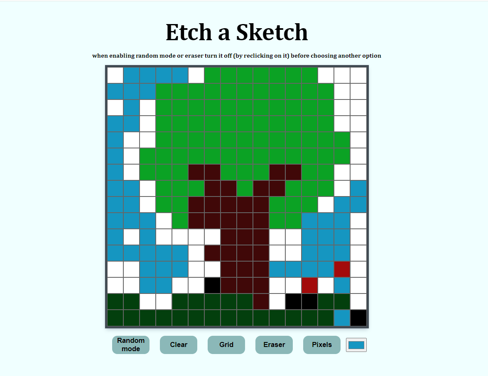

# Odin-Etch-a-Sketch
Etch a SKetch game assignement of the <a href="https://www.theodinproject.com/">the odin project</a> made with vanilla html css and js      
Its basically a pixel art canvas wher u can decide the number of pixels as well as the color and then fill it by just hovering on it   
<a href="https://nooorrrr.github.io/Odin-Etch-a-Sketch/">Click here to try it out<a>     

### preview :

